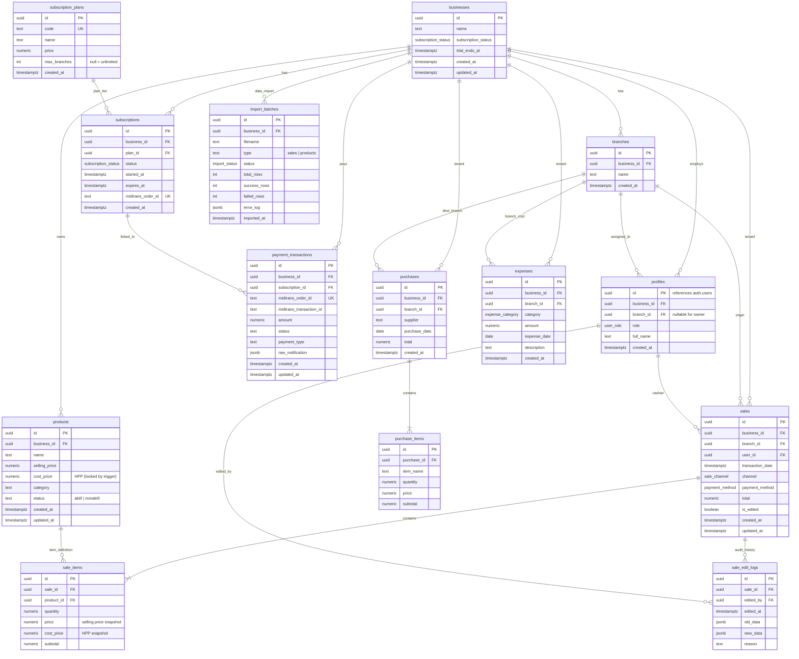

# Entity Relationship Diagram (ERD) — **Rekapin**

Dokumentasi skema database PostgreSQL Supabase untuk SaaS **Rekapin**, mencakup tabel multi-tenant, relasi entitas, enum, reporting views, triggers, dan kebijakan Row Level Security (RLS).

---

## 1. Visual Diagram Relasi (Mermaid ERD)



---

## 2. Definisi Custom Types (Enums)

| Enum Name | Allowed Values | Deskripsi |
|---|---|---|
| `user_role` | `'owner'`, `'pegawai'` | Role pengguna dalam sistem |
| `subscription_status` | `'trial'`, `'active'`, `'expired'`, `'canceled'` | Status langganan tenant |
| `sale_channel` | `'offline'`, `'gofood'`, `'grabfood'`, `'shopeefood'`, `'whatsapp'`, `'qris'`, `'lainnya'` | Saluran penjualan |
| `payment_method` | `'cash'`, `'qris'`, `'transfer'`, `'lainnya'` | Metode pembayaran transaksi |
| `expense_category` | `'gaji'`, `'listrik'`, `'air'`, `'sewa'`, `'gas'`, `'transportasi'`, `'marketing'`, `'packaging'`, `'peralatan'`, `'lainnya'` | Kategori pengeluaran operasional |
| `import_status` | `'pending'`, `'processing'`, `'success'`, `'failed'`, `'partial'` | Status batch import Excel/CSV |

---

## 3. Detail Skema Tabel

### 3.1. Multi-Tenant & Users
- **`businesses`**: Data tenant utama. Setiap pendaftaran owner baru menginisialisasi satu baris di sini dengan masa trial 7 hari default.
- **`branches`**: Cabang fisik di bawah tenant (`business_id`). Dihapus secara `CASCADE` jika tenant dihapus.
- **`profiles`**: Ekstensi `auth.users` Supabase. Menghubungkan user dengan `business_id` dan cabang (`branch_id`).
  - Owner: `branch_id = null` (dapat mengakses semua cabang).
  - Pegawai: `branch_id` bernilai fixed (terkunci hanya pada cabang tersebut).

### 3.2. Produk & Inventaris
- **`products`**: Katalog produk tenant.
  - Memiliki `cost_price` (HPP).
  - Diproteksi trigger `trg_enforce_cost_price`: jika user pembuat bukan role `owner`, `cost_price` dipaksa bernilai 0 di level database.

### 3.3. Penjualan & Kasir (Module 05)
- **`sales`**: Header transaksi penjualan. Menyimpan `branch_id`, `user_id` kasir, `channel`, `payment_method`, dan flag `is_edited`.
- **`sale_items`**: Detail item per transaksi.
  - **Prinsip Penting**: Menyimpan snapshot `cost_price` (HPP) dan `price` saat transaksi berlangsung, agar perubahan harga di kemudian hari tidak mengubah akurasi laporan historis.
- **`sale_edit_logs`**: Tabel audit trail append-only. Menyimpan snapshot `old_data` dan `new_data` dalam format JSONB setiap kali sebuah transaksi diedit.

### 3.4. Pembelian & Pengeluaran (Module 06-07)
- **`purchases` & `purchase_items`**: Pencatatan pembelian bahan baku/stok per cabang.
- **`expenses`**: Pengeluaran operasional di luar HPP (sewa, listrik, gaji, packaging, dll.).

### 3.5. Langganan & Pembayaran (Billing Midtrans)
- **`subscription_plans`**: Master harga paket: Basic (Rp100.000 / 1 cabang), Bisnis (Rp250.000 / 3 cabang), Profesional (Rp300.000 / unlimited cabang).
- **`subscriptions`**: Status langganan aktif tenant.
- **`payment_transactions`**: Riwayat transaksi webhook Midtrans.

### 3.6. Utilitas & Onboarding (Module 03)
- **`import_batches`**: Audit log import Excel (riwayat file, jumlah baris berhasil/gagal, log error).

---

## 4. Views & Reporting (Module 08-09)

### `v_sale_profit`
Menghitung omzet, total HPP snapshot, dan laba kotor per transaksi:
```sql
select
  s.id as sale_id,
  s.business_id,
  s.branch_id,
  s.transaction_date,
  s.channel,
  s.payment_method,
  s.total as omzet,
  coalesce(sum(si.cost_price * si.quantity), 0) as hpp,
  s.total - coalesce(sum(si.cost_price * si.quantity), 0) as laba_kotor
from sales s
left join sale_items si on si.sale_id = s.id
group by s.id, s.business_id, s.branch_id, s.transaction_date, s.channel, s.payment_method, s.total;
```

### `v_daily_recap`
Agregasi harian per cabang:
```sql
select
  business_id,
  branch_id,
  date(transaction_date) as tanggal,
  sum(omzet) as omzet,
  sum(hpp) as hpp,
  sum(laba_kotor) as laba_kotor
from v_sale_profit
group by business_id, branch_id, date(transaction_date);
```

---

## 5. Triggers & Stored Procedures

1. **`handle_new_user()`** (Trigger: `on_auth_user_created` pada `auth.users`):
   - **Mode Register Owner**: Jika `raw_user_meta_data->>'invited_business_id'` kosong, otomatis membuat baris baru di `businesses` dan `profiles` dengan role `owner`.
   - **Mode Invite Pegawai**: Jika metadata berisi `invited_business_id`, trigger mengaitkan pegawai ke bisnis dan cabang (`invited_branch_id`) yang ditentukan owner tanpa membuat bisnis baru.
2. **`enforce_cost_price_owner_only()`** (Trigger: `trg_enforce_cost_price` sebelum insert pada `products`):
   - Jika pengguna bukan owner (`not auth_is_owner()`), memaksa `new.cost_price := 0`.
3. **`expire_trials()`** (Eksekusi berkala via `pg_cron` tiap jam):
   - Mengubah status langganan menjadi `expired` jika melewati `trial_ends_at`.

---

## 6. Matrix Row Level Security (RLS)

| Tabel | Role Owner | Role Pegawai | Keterangan |
|---|---|---|---|
| `businesses` | Read & Update (milik sendiri) | Read (milik sendiri) | Tenant isolation |
| `branches` | Read, Create, Update, Delete | Read (milik sendiri) | Pegawai hanya baca |
| `profiles` | Read, Create, Update | Read sesama tenant | Owner kelola akun pegawai |
| `products` | Full CRUD | Read & Insert (HPP dipaksa 0 via trigger) | Pegawai lapor barang baru |
| `sales` | Full CRUD (semua cabang) | Read, Insert, Update (hanya cabangnya & transaksi miliknya) | Pegawai terkunci di `branch_id` |
| `sale_items` | Full CRUD | Read & Insert via `sales` miliknya | Mengikuti akses header `sales` |
| `sale_edit_logs` | Read all logs, Insert log saat edit | Read & Insert log saat edit transaksi sendiri | Append-only, tidak bisa diedit/dihapus |
| `purchases` | Full CRUD | **DIBLOKIR** (No Access) | Finansial owner-only |
| `purchase_items` | Full CRUD | **DIBLOKIR** (No Access) | Finansial owner-only |
| `expenses` | Full CRUD | **DIBLOKIR** (No Access) | Finansial owner-only |
| `subscriptions` | Read (milik sendiri) | **DIBLOKIR** (No Access) | Billing owner-only |
| `payment_transactions` | Read (milik sendiri) | **DIBLOKIR** (No Access) | Billing owner-only |
| `import_batches` | Full CRUD | **DIBLOKIR** (No Access) | Owner-only |
